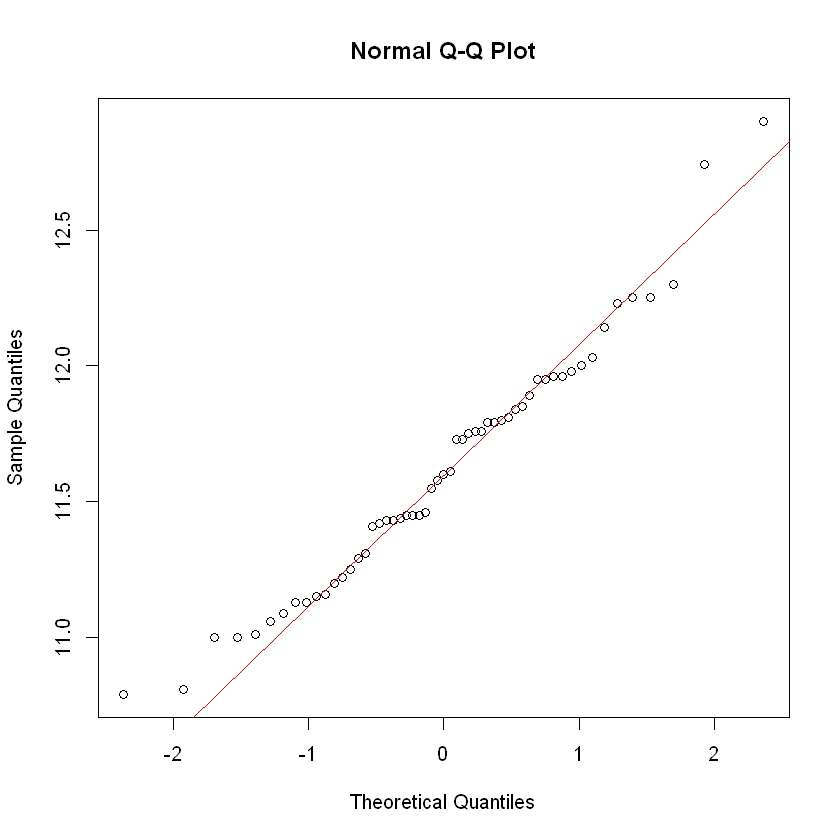
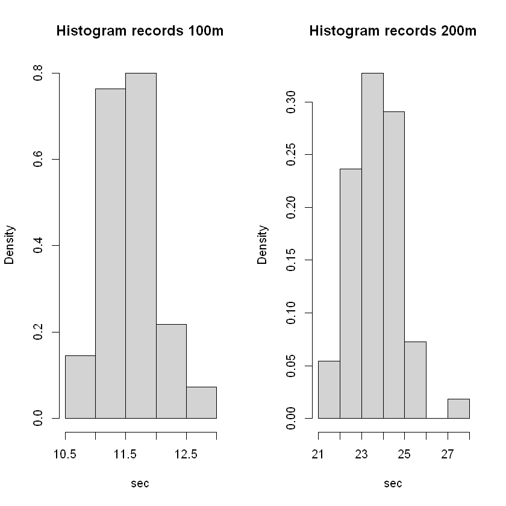
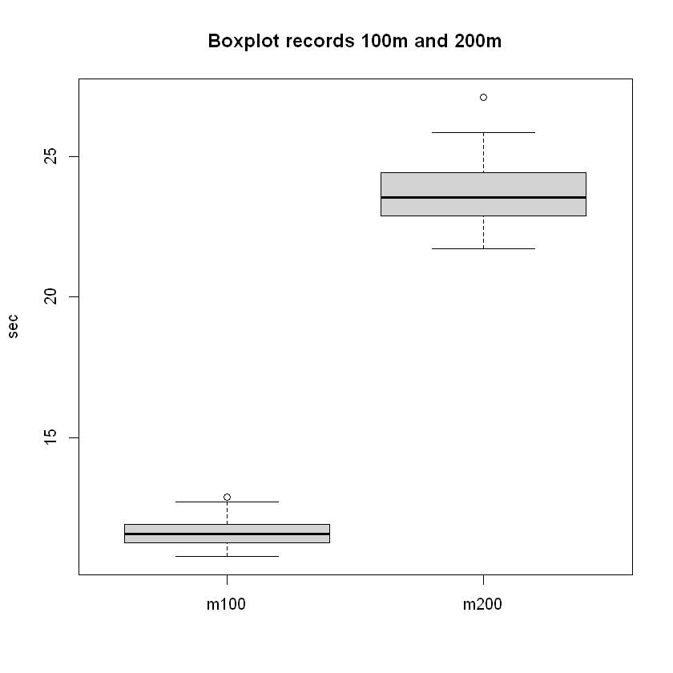
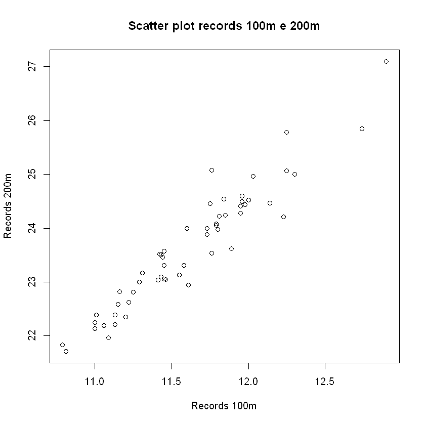
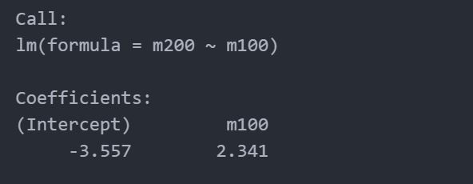
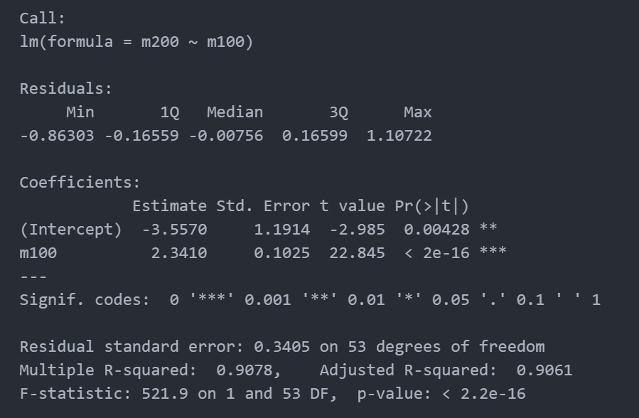
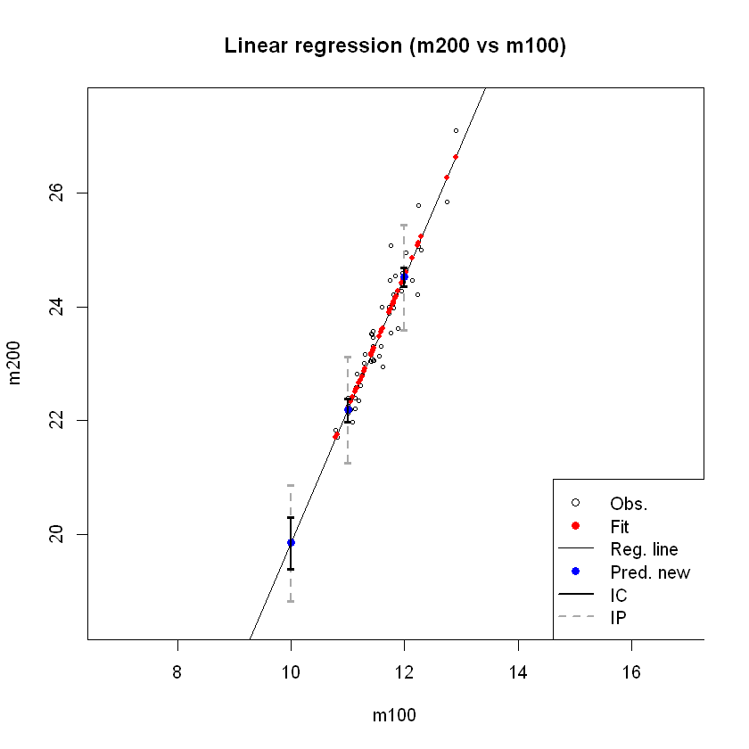

# Lab1
## QQplot
- QQ图，又称Quantile-Quantile图，是一种用于检验数据是否符合某种理论分布的图形方法。
- 它是通过比较数据分布的分位数与理论分布的分位数，来判断数据分布是否与理论分布接近的。
- 如果数据来自所假设的理论分布，那么QQ图上的点应该大致沿着一条直线分布。如果数据偏离这条直线，那么就表明数据不符合所假设的理论分布。
```R
### t-test for the mean value of the quantity 
### H0: mean == 11.5 vs H1: mean != 11.5

# Recall: qqplot to verify (qualitatively) the Gaussian assumption on the distribution generating sample;
# qqplot是一种用于检查数据是否符合正态分布的图形方法。

qqnorm(m100) # quantile-quantile plot 分位数-分位数图
qqline(m100, col='red') # theoretical line
```


## Shapiro-Wilk
- Shapiro-Wilk检验是一种用于检验一个样本是否来自正态分布的统计检验方法。
- 它也可以用于比较两个或多个样本的正态性，以确定它们是否来自同一种分布。
- 需要注意的是，Shapiro-Wilk检验对于样本数量较大时，可能会出现虚假的拒绝原假设的结果，因此在这种情况下，应该使用其他的正态性检验方法。


```R
# Shapiro-Wilk test to verify (quantitatively) the Gaussian assumption on the distribution generating sample
shapiro.test(m100)
----------------------------------------------------------
        Shapiro-Wilk normality test

data:  m100
W = 0.97326, p-value = 0.2569
# 由于p值大于0.05，因此H0成立。
```

## t检验
- t检验是一种用于检验两个样本均值是否存在显著性差异的统计检验方法。
- 它是通过比较两个样本的均值和方差之间的差异来判断这两个样本是否来自同一种总体分布。
- 通常情况下，t检验可以分为两种类型：独立样本t检验和配对样本t检验。
  - 独立样本t检验：用于比较两个独立的样本的均值是否有显著性差异，例如两个不同班级的学生的成绩是否有显著差异等。
  - 配对样本t检验：用于比较同一个样本在两个不同时间点或者两种不同条件下的均值是否有显著性差异，例如同一个班级的学生，在不同考试时间点的成绩是否有显著差异等。

- t检验的基本思想是计算两个样本的均值之间的差异是否显著大于由样本误差产生的随机差异。
- 在实际应用中，我们需要先计算出t统计量的值，然后将其与t分布表中的临界值进行比较，以判断差异是否显著。

```R
# 独立样本t检验
t.test(x, y, alternative = "two.sided", var.equal = TRUE/FALSE, conf.level = 0.95)

# 配对样本t检验
t.test(x, y, paired = TRUE, alternative = "two.sided", conf.level = 0.95)
```
其中，`x` 和 `y` 分别为两个待比较的样本数据，`var.equal` 表示是否假定两个样本方差相等，`paired` 表示是否为配对样本，`alternative` 表示检验假设的类型，`conf.level` 表示置信水平。如果函数的输出结果中的 P 值小于显著性水平（通常为 0.05），则可以拒绝原假设，认为样本均值存在显著性差异。

## t值

- 在统计学中，t值是一种用于计算差异是否显著的指标。t值是基于样本数据计算的，通常用于比较两组样本的均值是否有显著差异。
- 具体来说，在进行t检验时，我们计算两组样本的均值之间的差异，然后除以标准误差。标准误差是一个衡量样本均值和总体均值之间差异的指标。
- 然后，我们将计算出的差异值除以标准误差，就得到了t值。t值越大，表示样本均值之间的差异越显著。
- t值的计算公式为：$t = (sample.mean - mean.H0)/(sample.sd/\sqrt{n})$
- 其中`sample.mean`是样本均值，`mean.H0`是零假设下的总体均值，`sample.sd`是样本标准差，`n`是样本大小。
- 这个公式中，`(sample.mean - mean.H0)`表示样本均值和总体均值之间的差异，`(sample.sd / sqrt(n))`是衡量这个差异的标准误差，两者相除就得到了`t`值。

```R
# manually
sample.mean = mean(m100)
sample.sd = sd(m100)
n = length(m100)
tstat = (sample.mean - mean.H0) / (sample.sd / sqrt(n))
```

## t分位数
- t分位数是指t分布中某一累积概率下的分位点值。
- t分位数是指t分布中，使得累积分布函数的值为给定置信水平（例如95%）的那个数。
- 在统计推断中，t分位数常用于构建置信区间，以确定样本均值的不确定性范围。
- t分布是用于独立样本t检验和配对样本t检验中的重要概率分布。
- 在进行t检验时，我们需要计算t值，并将其与t分布中的临界值进行比较，以判断差异是否显著。t分位数就是t分布中的临界值。
- `t分位数 = qt(p, df)`
- 其中，`p`是累积概率，`df`是自由度。自由度指的是样本中可独立自由变化的元素个数，一般用样本大小减去1来计算。`qt()`是R语言中的t分布函数，可以根据给定的累积概率和自由度计算出对应的t分位数。
- 对于给定的置信水平和自由度，t分布的形状和位置是固定的，因此可以通过查找t分布表或使用R语言的`qt`函数来计算t分位数。例如，`qt(0.975, df)`表示自由度为`df`的t分布中，累积分布函数的值为0.975的t值。
- t分位数的大小取决于置信水平和自由度。在置信水平相同的情况下，自由度越大，t分位数越小，即样本均值与总体均值之间的差异越小，可信度越高。同样，在自由度相同的情况下，置信水平越高，t分位数越大，即要求置信度越高，需要更大的差异才能拒绝零假设。
- 自由度是指用于衡量样本数据集的独立性和变异性的数量。在t检验中，自由度用于描述t分布的形状和位置。
- 在一次单样本t检验中，自由度通常定义为样本大小减去1，即 n-1。
- 在两个样本t检验中，自由度为 n1+n2-2
```R
cfr.t = qt(1 - alpha/2, n-1) #1-0.05/2=0.975
```
- 比较t值的绝对值和双侧置信区间的t分位数的大小，如果t值的绝对值小于置信区间的t分位数，则无法拒绝零假设，否则拒绝零假设。
```R
abs(tstat) < cfr.t  # if be TRUE, cannot reject H0 (accept H0)
```

## P-Value
- 通常情况下，P值越小，说明得到这个样本数据的可能性越小，从而对零假设越不支持。
- 如果`tstat`大于等于0，则计算的是双侧检验的p值，公式为`(1 - pt(tstat, n-1)) * 2`。其中`pt()`是t分布的累积分布函数（CDF），它计算给定t值和自由度的t分布累积概率密度。因此，`1 - pt(tstat, n-1)`给出了t分布右侧的概率密度，再乘以2则得到了双侧检验的p值。
- 如果`tstat`小于0，则计算的也是双侧检验的p值，公式为`pt(tstat, n-1) * 2`。其中`pt()`函数同上，但是这次计算的是t分布左侧的概率密度，再乘以2则得到了双侧检验的p值。
```R
# ifelse(condition, true_val, false_val)
# 其中，condition是一个逻辑表达式，如果为TRUE，则返回true_val，否则返回false_val。
pval = ifelse(tstat >= 0, (1 - pt(tstat, n-1))*2, pt(tstat, n-1)*2)
```
## Confidence Interval
- 置信区间是指在给定置信水平下，总体参数的取值范围。
- 在统计学中，我们通常只能通过样本来估计总体参数，而样本的估计值有一定的误差。置信区间就是用来描述这种误差范围的概念。
- 例如，我们想要估计某一总体的均值，可以使用样本均值作为估计值。但是，由于样本的随机性和不确定性，样本均值很可能与总体均值有一定差异。
- 为了描述这种不确定性，我们可以给出一个区间，称之为置信区间，这个区间包含总体均值的可能范围。
- 置信区间的范围取决于置信水平和样本的大小。常见的置信水平有90%、95%和99%等。
- 置信水平越高，置信区间的范围就越宽，反之亦然。样本的大小也会影响置信区间的范围，样本大小越大，置信区间的范围就越小。
- 通常，我们可以使用t分布或者正态分布来计算置信区间。对于样本均值的置信区间，计算公式如下：
  - **置信区间 = 样本均值 ± 标准误差* t值**
  - 其中，t值是根据置信水平和自由度（n-1）查找t分布表得到的，标准误差是样本标准差除以样本大小的平方根。

- 在统计学中，置信区间（Confidence Interval，CI）是指对总体参数的一个区间估计，该区间可能包含未知参数的真实值，也可能不包含。
```R
CI =  c(inf     = sample.mean - sample.sd / sqrt(n) * qt(1 - alpha/2, n-1), 
        center  = sample.mean, 
        sup     = sample.mean + sample.sd / sqrt(n) * qt(1 - alpha/2, n-1))
# inf：置信区间的下限，即样本均值的下限估计值；
# center：置信区间的中心，即样本均值的估计值；
# sup：置信区间的上限，即样本均值的上限估计值。
```

## 直方图
- 直方图是一种常见的数据可视化工具，通常用来表示数值型变量的分布情况。
- 它将数据按照一定的区间（或者称为“组”）进行划分，并统计每个区间内数据的频数或频率，然后将这些频数或频率绘制在图表中，形成一组高度不等的柱形。
- 每个柱形代表一个区间，其高度表示该区间内数据的频数或频率，而柱形之间的间隔则表示各区间之间的间隔。
```R
par(mfrow=c(1, 2)) # 子图 1×2

# prob=T 表示要对纵轴进行标准化，
# 将频数转换为概率密度，使得纵轴的范围在0到1之间。

# 其中，breaks参数表示分组区间的数量，默认为30
hist(m100, breaks = 30, prob=T, main="Histogram records 100m", xlab="sec")
hist(m200, breaks = 30, prob=T, main="Histogram records 200m", xlab="sec")
```


## Boxplot
- 箱型图（Box Plot）是一种数据可视化图表，常用于显示数据的分布情况。
- 它可以显示出数据的中位数、上下四分位数、最大值和最小值等统计指标，并用箱体和虚线来表示数据的分布范围。

- 具体来说，箱型图通常由以下五个部分组成：
  1. 上边缘：箱体上面的横线，表示数据的最大值。
  2. 上四分位数：箱体上边界内部的横线，表示数据的75%分位数。
  3. 中位数：箱体内部的横线，表示数据的50%分位数。
  4. 下四分位数：箱体下边界内部的横线，表示数据的25%分位数。
  5. 下边缘：箱体下面的横线，表示数据的最小值。
- 箱体的高度表示数据的中间50%的范围，箱体越高表示数据的变异程度越大。
- 箱型图的上下边缘之外还会有一些离群点（Outliers），它们通常被定义为超过1.5倍IQR（四分位距）的数据点。
```R
# record[,1:2]代表m100和m200
boxplot(record[,1:2], main="Boxplot records 100m and 200m", ylab="sec")
```


## 散点图
- Scatter plot（散点图）是一种用于展示两个变量之间关系的图表类型。
- Scatter plot（散点图）是一种用于展示两个变量之间关系的图表类型。

```R
plot(m100, m200, main='Scatter plot records 100m e 200m', xlab="Records 100m", ylab="Records 200m")
```


## Linear Model
- 在R语言中，可以使用`lm()`函数来拟合线性模型，进行简单线性回归或多元线性回归分析。

```R
# Fit of the linear model (command lm)
# Model: m200 = beta0 + beta1 * m100 + eps, eps ~ N(0, sigma^2)
# 使用线性回归模型 lm() 对两个变量 m200 和 m100 进行建模。m100 是自变量，也称为解释变量或预测变量，而 m200 是因变量，也称为响应变量或目标变量。
regression = lm(m200 ~ m100)
regression
```


- 回归系数是 2.341，表示当 m100 的值增加 1 个单位时，m200 的平均值会增加 2.341 个单位；
- 而截距为 -3.557，表示当 m100 的值为 0 时，m200 的平均值为 -3.557。

```R
# 查看模型摘要
summary(regression)
```



- `Residuals`: 显示残差的统计信息，包括最小值、最大值、中位数、均值等。
  - Residuals（残差）指的是观测值和线性回归模型的预测值之间的差异。
  - 具体地说，对于一个线性回归模型，我们可以通过将模型的预测值减去实际观测值得到残差，即 $e_i = y_i - \hat{y_i}$，其中 $y_i$ 是第 $i$ 个观测值的实际值，$\hat{y_i}$ 是模型预测的第 $i$ 个观测值的值。
  - 残差可以用来评估模型的拟合优度，通常我们希望残差越小越好。在线性回归中，残差服从正态分布是线性回归的假设之一，检查残差是否符合正态分布可以评估该假设是否成立。
- `Coefficients`: 显示回归系数的统计信息，包括回归系数的估计值（`Estimate`）、标准误差（`Std. Error`）、t值（`t value`）和p值（`Pr(>|t|)`）等。
  - `Estimate`：回归系数的估计值，即样本中的系数值。
  - `Std. Error`：标准误差，用于衡量回归系数的精度，标准误差越小，说明样本越大，回归系数的估计值就越准确。
  - `t value`：t统计量，用于检验回归系数是否显著不为零，即是否对应着一个重要的解释变量。
  - `Pr(>|t|)`：p值，表示回归系数是否显著不为零的概率，当p值小于0.05时，我们通常认为回归系数是显著不为零的。
- ·Residual standard error·: 残差标准误差，用于衡量模型预测误差的大小，值越小表示模型对样本的拟合
- `Multiple R-squared`: 多重R平方，是R平方的改进版，其定义为“回归平方和（SSR）除以总平方和（SST）”，可以看作是回归对总变异的解释程度，取值范围在0到1之间，值越大表示回归方程对因变量的解释能力越强。
  - 总和平方和(SST)：$SST = \sum_{i=1}^{n}(y_i - \bar{y})^2$
  - 残差平方和(RSS)：$RSS = \sum_{i=1}^{n}(y_i - \hat{y_i})^2$
  - 回归平方和(SSR)：$SSR = \sum_{i=1}^{n}(\hat{y_i} - \bar{y})^2$
  - 其中，$y_i$ 表示第 $i$ 个观测值的实际值，$\hat{y_i}$ 表示线性回归模型对第 $i$ 个观测值的预测值，$\bar{y}$ 表示所有观测值的平均值，$n$ 表示样本数量。
  - $SST=SSR+RSS$
- `Adjusted R-squared`: 调整后的多重R平方，这是多元线性回归中使用的一个衡量模型拟合优度的统计量，它会对自变量个数进行校正，避免过多自变量带来的过拟合问题。
- `F-statistic`: F统计量，用于检验整个回归模型是否显著，计算公式为“**（回归平方和/自由度）/（残差平方和/自由度）**”，${\frac{SSR}{\mathbf{df}_{SSR}}}/{\frac{RSS}{\mathbf{df}_{RSS}}}$，F值越大表示整个模型对数据的解释能力越强。
- `p-value`: F统计量的p值，表示整个回归模型是否显著不为零的概率，当p值小于0.05时，我们通常认为整个回归模型是显著为零的。

```R
coef(regression) # 提取线性回归模型的系数（截距和斜率）。
vcov(regression) # 计算线性回归模型的方差协方差矩阵。 variance-covariance
residuals(regression) # 提取线性回归模型的残差。
fitted(regression) # 提取线性回归模型的拟合值。
```

```R
# Test F "by hand" (H0: beta1=0 vs H1: beta1!=0)
# 计算线性回归模型中的回归平方和（SSR）
SSR = sum((fitted(regression) - mean(m200))^2)
# 残差平方和越小，说明回归直线越能解释响应变量的变异，回归模型越好。
RSS = sum(residuals(regression)^2)
# 总和平方和(SST)（total sum of squares)
SST = sum((m200 - mean(m200))^2)
```
- 回归平方和（SSR）表示模型的解释能力，即模型中独立变量（m100）**所解释的因变量**（m200）变异部分的平方和。
- 残差平方和（RSS）表示模型未能解释的部分，即模型中**未被独立变量所解释**的因变量的变异部分的平方和。
- 总离差平方和（SST）表示因变量（m200）的变异总和，可以理解为**所有数据点**离总体均值的偏差平方和。
<br>

- `F-statistic`: F统计量，用于检验整个回归模型是否显著，计算公式为“**（回归平方和/自由度）/（残差平方和/自由度）**”，${\frac{SSR}{\mathbf{df}_{SSR}}}/{\frac{RSS}{\mathbf{df}_{RSS}}}$，F值越大表示整个模型对数据的解释能力越强。
```R
Fstat = (SSR/1) / (RSS/(n-2))
P = 1 - pf(Fstat, 1, n-2) # =0, reject H0
```

- 这段代码计算的是简单线性回归模型的F统计量，用于检验模型的拟合优度是否显著 
- Fstat 表示F统计量，是回归平方和与残差平方和的比值，度量回归平方和在总平方和中所占的比例，即模型对总变异的解释能力。其分布服从自由度为1（回归平方和）和n-2（残差平方和）的F分布。
- 通过计算F统计量，可以判断模型的拟合优度是否显著，即模型是否能够显著解释数据的变异程度。如果F值较大，且p值较小（通常显著性水平取0.05），则拒绝原假设，认为模型的拟合优度显著。反之，不能拒绝原假设，认为模型的拟合优度不显著。
<br>
- `pf()` 函数是用于计算 F 分布的累积分布函数（Cumulative Distribution Function, CDF）。
- F 分布通常用于检验两个或多个总体方差是否相等。

## Confidence Interval And Prediction Interval
**Confidence Interval**
- Confidence interval（置信区间）是对于总体参数（如总体均值或总体比例）的估计提供了一个范围，置信区间可以用来估计总体参数的真实值的范围。
- Confidence interval（置信区间）是对于总体参数（如总体均值或总体比例）的估计提供了一个范围，置信区间可以用来估计总体参数的真实值的范围。
- 例如，如果一个置信区间为95%，意味着在重复采样实验中，有95%的置信区间都会覆盖真实总体参数值。

**Prediction interval**
- Prediction interval（预测区间）是对于未来观测值的估计提供了一个范围，预测区间可以用来估计未来观测值的真实值的范围。
- 具体而言，预测区间是一个区间范围，其中未来观测值有一定概率（预测水平）落在这个区间内。
- 与置信区间不同，预测区间考虑了对于随机误差的不确定性，因此预测区间通常比置信区间要宽。
```R
# Confidence and prediction intervals (command predict)

newdata = data.frame(m100=c(10, 11, 12))
# 函数 predict() 的第一个参数是拟合好的线性回归模型 regression，
# 第二个参数是新的数据集(测试集) newdata。
# 函数默认返回预测值
pred_nd = predict(regression, newdata)
pred_nd

# 函数默认返回预测值，
# 但是可以使用可选参数 interval 来返回置信区间或预测区间。
IC_nd = predict(regression, newdata, interval='confidence', level=.99)
IC_nd

IP_nd = predict(regression, newdata, interval='prediction', level=.99)
IP_nd
```


