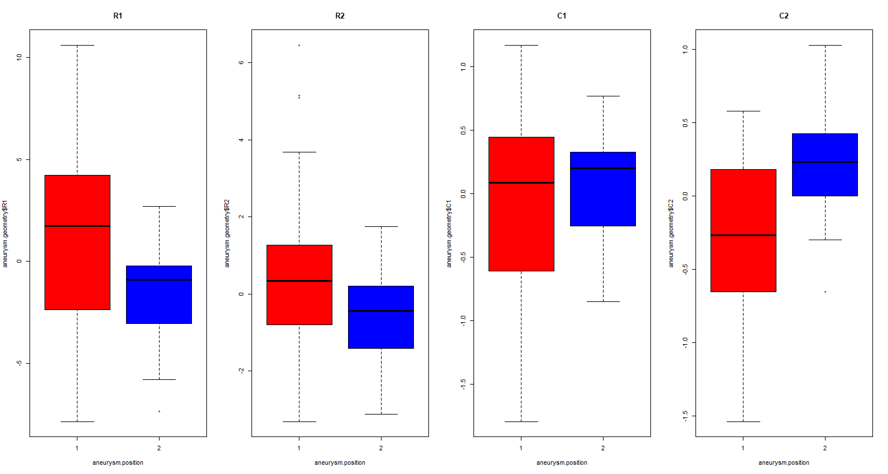

# Lab 1

## Topics
- Basic Commands (scalars, vectors, matrices, and operations)
- Import/Export of dataframes
- Examples of univariate statistical analyses with plots
- Visualization of Multivariate Data
- Visualization of Categorical Data
- 3D plots, functions, "for" cycles
- Save plots

### Basic Commands

the command:`getwd()`, its function is that returning the current working directory'
```R
getwd()
----------------------------------------------------------
[1] "F:/OneDrive/POLIMI"
```
We can also set the working directory
```R
setwd("F:/OneDrive/POLIMI/Semester 4/Applied Statistics/2023/Lab/Labs-20230401/Lab 1")
```
#### Scalars
```R
a = 1
a
----------------------------------------------------------
[1] 1
```

#### Vectors
```R
v = c(2, 3, 5, 4)
v
----------------------------------------------------------
[1] 2 3 5 4
```

```R
u = seq(2, 5, len = 4) # 输出4个元素，从2到5
u
----------------------------------------------------------
[1] 2 3 4 5
```

```R
u = seq(2, 5, by = 1) # 输出由2到5步长为1的所有元素
u
----------------------------------------------------------
[1] 2 3 4 5
```

```R
z = 2:5
z
----------------------------------------------------------
[1] 2 3 4 5
```

#### Matrices
```R
W = rbind(c(11 13 15), c(12, 14, 16)) # rbind()由行生成矩阵
W
----------------------------------------------------------
     [,1] [,2] [,3]
[1,]   11   13   15
[2,]   12   14   16
```

```R
W = cbind(c(11, 12), c(13, 14), c(15, 16)) # cbind()由行生成矩阵
----------------------------------------------------------
     [,1] [,2] [,3]
[1,]   11   13   15
[2,]   12   14   16
```

```R
W = matrix(data = c(11, 12, 13, 14, 15, 16), nrow = 2, ncol = 3, byrow = F)
# data 为矩阵所有元素，生成一个2行3列 排序按列生成的矩阵

# 也可简写为
W = matrix(data = c(11, 12, 13, 14, 15, 16),2,3) # byrow 默认为 F
----------------------------------------------------------
     [,1] [,2] [,3]
[1,]   11   13   15
[2,]   12   14   16
```

#### Extraction of elements from a vector or a matrix

```R
v
----------------------------------------------------------
[1] 2 3 5 4
```
```R
v[2]
----------------------------------------------------------
[1] 3
```
```R
v[-3]
----------------------------------------------------------
[1] 2 3 4
```
```R
v[-c(1, 4)]
----------------------------------------------------------
[1] 3 5
```

```R
W
----------------------------------------------------------
     [,1] [,2] [,3]
[1,]   11   13   15
[2,]   12   14   16
```
```R
W[2, 3] # 输出第二行第三列的元素值
----------------------------------------------------------
[1] 16
```
```R
W[2, c(2, 3)] # 输出第二行的第二列和第三列的元素值
----------------------------------------------------------
[1] 14 16
```
```R
W[2, ] # 输出第二行的所有元素值
----------------------------------------------------------
[1] 12 14 16
```
```R
W[, c(2, 3)] # 输出所有行的第二列和第三列的值
----------------------------------------------------------
     [,1] [,2]
[1,]   13   15
[2,]   14   16
```

**Remark: in R vectors "are not" matrices $n*1$ or $1*n$**
vectors have only one index, whereas matrices have two indices (for rows and columns).

```R
# 转换 1*n 向量 为 矩阵
v 
----------------------------------------------------------
[1] 2 3 5 4
```
```R
rbind(v)
----------------------------------------------------------
  [,1] [,2] [,3] [,4]
v    2    3    5    4
```
```R
cbind(v)
----------------------------------------------------------
     v
[1,] 2
[2,] 3
[3,] 5
[4,] 4
```

#### Algebraic operations
```R
a = 1
b = 2
c = c(2, 3, 4)
d = c(10, 10, 10)

Z = matrix(c(1, 10, 3, 10, 5, 10), 2, 3)
Z
----------------------------------------------------------
     [,1] [,2] [,3]
[1,]    1    3    5
[2,]   10   10   10
```

```R
a + b # scalar + scalar
----------------------------------------------------------
[1] 3
```
```R
c + d # vector + vector
----------------------------------------------------------
[1] 12 13 14
```
```R
a * b # scalar * scalar
----------------------------------------------------------
[1] 2
```
```R
c * d # vector * vector (component-wise) 点对点乘
----------------------------------------------------------
[1] 20 30 40
```
```R
c + a # vector + scalar 向量中的每个元素都加上该标量
----------------------------------------------------------
[1] 3 4 5
```
```R
c^2 # attention: operations are always component-wise! 点乘
----------------------------------------------------------
[1]  4  9 16
```
```R
exp(c) #还是点运算
----------------------------------------------------------
[1]  7.389056 20.085537 54.598150
```
```R
sum(c) # sums the components of c 累加所有向量中的元素
----------------------------------------------------------
[1] 9
```
```R
prod(c) # returns the product of the components of c 累乘
----------------------------------------------------------
[1] 24
```
```R
V = t(W) # transpose of a matrix
----------------------------------------------------------
     [,1] [,2]
[1,]   11   12
[2,]   13   14
[3,]   15   16
```
```R
Z + W # matrix + matrix (component-wise) 等大小矩阵点加
----------------------------------------------------------
     [,1] [,2] [,3]
[1,]   12   16   20
[2,]   22   24   26
```
```R
Z * W # matrix * matrix (component-wise) 等大小矩阵点乘

----------------------------------------------------------
     [,1] [,2] [,3]
[1,]   11   39   75
[2,]  120  140  160
```

```R
V * W # matrix * matrix (component-wise) (error!) 非等大小无法相乘
----------------------------------------------------------
Error in V * W : non-conformable arrays
```

```R
V %*% W # Matrix multiplication 纯纯的矩阵乘法
----------------------------------------------------------

     [,1] [,2] [,3]
[1,]  265  311  357
[2,]  311  365  419
[3,]  357  419  481
```
```R
W %*% V 
----------------------------------------------------------
     [,1] [,2]
[1,]  515  554
[2,]  554  596
```

```R
W + a # matrix + scalar 矩阵每个元素加该标量
----------------------------------------------------------
     [,1] [,2] [,3]
[1,]   12   14   16
[2,]   13   15   17
```
```R
W + c # matrix + vector 整数倍循环
----------------------------------------------------------
     [,1] [,2] [,3]
[1,]   13   17   18
[2,]   15   16   20
```
```R
W + 2:5 # 矩阵和向量 非整数倍无法相加
----------------------------------------------------------
longer object length is not a multiple of shorter object length
```
```R
# Inverse of a matrix (square and invertible)
A = matrix(c(11, 13, 12, 14), ncol=2, nrow=2, byrow=TRUE)
det(A) # 计算矩阵A的行列式
solve(A) # 求解线性方程组 Ax = b，其中b是一个列向量，在这里默认单位矩阵
----------------------------------------------------------
r$> det(A)
[1] -2

r$> solve(A)
     [,1] [,2]
[1,]   -7  6.5
[2,]    6 -5.5
```

```R
# Solution of a linear system Ax=b
b = c(1, 1)
solve(A, b)
----------------------------------------------------------
[1] -0.5  0.5
```

### Categorical Data

```R
# factor() 有点类似sorted
district = c('MI', 'MI', 'VA', 'BG', 'LO', 'LO', 'CR', 'Alt', 'CR', 'MI', 'Alt', 'CR', 'LO', 'VA', 'MI', 'Alt', 'LO', 'MI')

district = factor(district, levels=c('MI', 'LO', 'BG', 'CR', 'VA', 'Alt'))
district
----------------------------------------------------------
 [1] MI  MI  VA  BG  LO  LO  CR  Alt CR  MI  Alt CR  LO  VA  MI  Alt LO  MI
Levels: MI LO BG CR VA Alt
```

```R
resass = table(district) # table of absolute frequencies 用来统计出现次数
resass
----------------------------------------------------------
district
 MI  LO  BG  CR  VA Alt 
  5   4   1   3   2   3 
```
```R
# 除以列表总长度，用来计算频率
resrel <- table(district) / length(district) # table of relative frequencies
resrel
----------------------------------------------------------
district
        MI         LO         BG         CR         VA        Alt
0.27777778 0.22222222 0.05555556 0.16666667 0.11111111 0.16666667 
```

- lists: objects made of objects (objects can be of different type)

```R
exam = list(course = 'Applied Statistics',
            data = '27/09/2022',
            enrolled = 7,
            corrected = 6,
            student_id = as.character(c(45020, 45679, 46789, 43126, 42345,47568, 45674)),
            # as.character(c(...))将向量数据转换为字符串
            evaluation = c(30, 29, 30, NA, 25, 26, 27)
)
----------------------------------------------------------
$course
[1] "Applied Statistics"
$date
[1] "27/09/2022"
$enrolled
[1] 7
$corrected
[1] 6
$student_id
[1] "45020" "45679" "46789" "43126" "42345" "47568" "45674"
$evaluation
[1] 30 29 30 NA 25 26 27
```
```R
exam$evaluation
exam[[6]]
# 这两行代码都可以evaluation列表输出 $符号后面可以直接输出 也可以因为其是第六行数据
----------------------------------------------------------
[1] 30 29 30 NA 25 26 27
```
```R
# data.frame可以看作是一张表格，其中每一列可以是不同的数据类型，如字符型、数值型、因子变量等。

exam = data.frame(
    student_id = factor(as.character(c(45020, 45679, 46789, 43126, 42345, 47568, 45674))),
    evaluated_W = c(30, 29, 30, NA, 25, 26, 17),
    evaluation_O = c(28, 30, 30, NA, 28, 27, NA), 
    evaluation_P = c(30, 30, 30, 30, 28, 28, 28),
    outcome = factor(c('Passed', 'Passed', 'Passed', 'To be repeated', 'Passed','Passed', 'To be repeated'))
)
exam
# 它非常像矩阵，但是它不是。
----------------------------------------------------------
  student_id evaluation_W evaluation_O evaluation_P        outcome
1      45020           30           28           30         Passed
2      45679           29           30           30         Passed
3      46789           30           30           30         Passed
4      43126           NA           NA           30 To be repeated
5      42345           25           28           28         Passed
6      47568           26           27           28         Passed
7      45674           17           NA           28 To be repeated
```
```R
exam[2, ] # 输出第二行所有信息
----------------------------------------------------------
  student_id evaluation_W evaluation_O evaluation_P outcome
2      45679           29           30           30  Passed
```

```R 
# If we output `evaluation_W` directly, it won't work
evaluation_W
----------------------------------------------------------
Error: object 'evaluation_W' not found
```

```R
# But when we use `attach()`
attach(exam)
evaluation_W
----------------------------------------------------------
[1] 30 29 30 NA 25 26 17
```
```R
detach(exam)
evaluation_W
```

### Data Import/Export
```R
record = read.table('record.txt', header = T) #header = T 表示txt文件第一行为表格名称
record
----------------------------------------------------------
          m100  m200  m400 m800 m1500 m3000 Marathon
argentin 11.61 22.94 54.50 2.15  4.43  9.79   178.52
australi 11.20 22.35 51.08 1.98  4.13  9.08   152.37
......
rumania  11.44 23.46 51.20 1.92  3.96  8.53   165.45
singapor 12.30 25.00 55.08 2.12  4.52  9.94   182.77
```

```R
head(record) # 显示该文本的前六行数据
dim(record) # 显示该文本有多少行和列
dimnames(record) # 显示该文本的所有行和列的名称 行为 [[1]] 列为 [[2]]
----------------------------------------------------------
r$> head(record)
          m100  m200  m400 m800 m1500 m3000 Marathon
argentin 11.61 22.94 54.50 2.15  4.43  9.79   178.52
australi 11.20 22.35 51.08 1.98  4.13  9.08   152.37
austria  11.43 23.09 50.62 1.99  4.22  9.34   159.37
belgium  11.41 23.04 52.00 2.00  4.14  8.88   157.85
bermuda  11.46 23.05 53.30 2.16  4.58  9.81   169.98
brazil   11.31 23.17 52.80 2.10  4.49  9.77   168.75

r$> dim(record)
[1] 55  7

r$> dimnames(record)                                                                                                           
[[1]]                                                                                                                          
 [1] "argentin" "australi" "austria"  "belgium"  "bermuda"  "brazil"   "burma"    "canada"   "chile"    "china"    "columbia"  
[12] "cookis"   "costa"    "czech"    "denmark"  "domrep"   "finland"  "france"   "gdr"      "frg"      "gbni"     "greece"    
[23] "guatemal" "hungary"  "india"    "indonesi" "ireland"  "israel"   "italy"    "japan"    "kenya"    "korea"    "dprkorea"  
[34] "luxembou" "malaysia" "mauritiu" "mexico"   "netherla" "nz"       "norway"   "png"      "philippi" "poland"   "portugal"  
[45] "rumania"  "singapor" "spain"    "sweden"   "switzerl" "taipei"   "thailand" "turkey"   "usa"      "ussr"     "wsamoa"    

[[2]]
[1] "m100"     "m200"     "m400"     "m800"     "m1500"    "m3000"    "Marathon"
```
```R
# Transform times in seconds
# m800开始时间单位变了
record[, 4:7] = recordp[, 4:7] * 60
record
----------------------------------------------------------
          m100  m200  m400 m800 m1500 m3000 Marathon
argentin 11.61 22.94 54.50 7740 15948 35244   642672
australi 11.20 22.35 51.08 7128 14868 32688   548532
austria  11.43 23.09 50.62 7164 15192 33624   573732
...
ussr     11.06 22.19 49.19 6804 13932 30420   544392
wsamoa   12.74 25.85 58.73 8388 20916 46944  1101600
```
```R
# We can save a data frame (or a matrix)
write.table(record, file = 'record_mod.txt')
```
```R
# to save several objects in the workspace
W = matrix(data = c(11, 12, 13, 14, 15, 16), 2, 3)
V = t(W)
a = 1
save(W, V, a, file = 'variousobjects.RData')
# to save the entire workspace: save.image('FILENAME.RData')
save.image("myworkspace.RData")
```
```R
# this command remove all the variable of the workspace
ls() # 列出当前所有变量
----------------------------------------------------------
 [1] "a"        "A"        "b"        "c"        "d"        "district" "exam"     "record"   "resass"   "resrel"   "u"
[12] "v"        "V"        "W"        "z"        "Z"
```
```R
rm(list=ls()) # remove所有变量
```
### Visualization 

```R
##### Example: analysis of quantitative data (with plots) 
record <- read.table('record_mod.txt', header=T)
record

# some synthetic indices
colMeans(record) # 这行代码计算数据框(record)每列的均值。
# sapply(X, FUN, ...) 其中X是需要迭代的向量或列表，FUN是应用于每个元素的函数，...表示函数FUN的额外参数。sapply函数返回一个向量或矩阵，其中包含FUN应用于每个元素的结果。
sapply(record, mean) # sapply函数计算数据框(record)每列的均值，结果与colMeans函数相同。
----------------------------------------------------------
       m100        m200        m400        m800       m1500       m3000    Marathon
   11.61855    23.64164    53.40582   124.58182   259.52727   566.85818 10395.19636
```
```R
sapply(record, sd) # 使用sapply函数计算数据框(record)每列的标准差。
----------------------------------------------------------
        m100         m200         m400         m800        m1500        m3000     Marathon
   0.4522103    1.1110602    2.6783367    6.4934466   19.9455319   49.4601474 1825.7726951
```
```R
sapply(record, var) # 使用sapply函数计算数据框(record)每列的方差。
----------------------------------------------------------
        m100         m200         m400         m800        m1500        m3000     Marathon
2.044941e-01 1.234455e+00 7.173488e+00 4.216485e+01 3.978242e+02 2.446306e+03 3.333446e+06
```
```R
cov(record) # 计算数据框(record)中每对变量之间的协方差矩阵。
----------------------------------------------------------
                m100         m200        m400        m800        m1500       m3000     Marathon
m100       0.2044941    0.4787135    1.010955    2.136788     6.569596    16.58912     566.6616
m200       0.4787135    1.2344547    2.550142    5.223808    15.476232    39.00968    1390.7176
m400       1.0109549    2.5501422    7.173488   15.624737    42.087172   103.01428    3449.5477
m800       2.1367879    5.2238081   15.624737   42.164848   116.772727   277.34848    9238.9436
m1500      6.5695960   15.4762323   42.087172  116.772727   397.824242   956.09394   31970.8279
m3000     16.5891232   39.0096808  103.014285  277.348485   956.093939  2446.30618   81258.0017
Marathon 566.6616242 1390.7175616 3449.547725 9238.943636 31970.827879 81258.00170 3333445.9341
```
```R
cor(record) # 计算数据框(record)中每对变量之间的相关系数矩阵。
----------------------------------------------------------
              m100      m200      m400      m800     m1500     m3000  Marathon
m100     1.0000000 0.9527911 0.8346918 0.7276888 0.7283709 0.7416988 0.6863358
m200     0.9527911 1.0000000 0.8569621 0.7240597 0.6983643 0.7098710 0.6855745
m400     0.8346918 0.8569621 1.0000000 0.8984052 0.7878417 0.7776369 0.7054241
m800     0.7276888 0.7240597 0.8984052 1.0000000 0.9016138 0.8635652 0.7792922
m1500    0.7283709 0.6983643 0.7878417 0.9016138 1.0000000 0.9691690 0.8779334
m3000    0.7416988 0.7098710 0.7776369 0.8635652 0.9691690 1.0000000 0.8998374
Marathon 0.6863358 0.6855745 0.7054241 0.7792922 0.8779334 0.8998374 1.0000000
```
```R
##### Descriptive/inferential analysis on the variable m100 ('very basic'!)
attach(record)

### t-test for the mean value of the quantity 
### H0: mean == 11.5 vs H1: mean != 11.5

# Recall: qqplot to verify (qualitatively) the Gaussian assumption on the distribution generating sample; qqplot是一种用于检查数据是否符合正态分布的图形方法。

qqnorm(m100) # quantile-quantile plot
qqline(m100, col='red') # theoretical line
```


```R
# 还有另一种方法
# Shapiro-Wilk test to verify (quantitatively) the Gaussian assumption on the distribution generating sample
shapiro.test(m100)
----------------------------------------------------------
        Shapiro-Wilk normality test

data:  m100
W = 0.97326, p-value = 0.2569
# 由于p值大于0.05，因此H0成立。
```

```R
alpha = 0.05
mean.H0 = 11.5

# automatically
# m100为需要检测的数据；mu为H0假设均值；alternative为备择假设的类型；置信水平默认为0.95
t.test(m100, mu = mean.H0, alternative = 'two.sided', conf.level = 1-alpha)
----------------------------------------------------------
        One Sample t-test

data:  m100
t = 1.9441, df = 54, p-value = 0.0571
alternative hypothesis: true mean is not equal to 11.5
95 percent confidence interval:
 11.4963 11.7408
sample estimates:
mean of x
 11.61855
```

```R
# manually
sample.mean = mean(m100)
sample.sd = sd(m100)
n = length(m100)

# 这个公式是用来计算t检验的检验统计量（t值）的。
# 其中，sample.mean表示样本的均值，mean.H0表示零假设的均值，sample.sd表示样本的标准差，n表示样本大小。
# 这个公式的意义是，将样本均值与零假设的均值之差除以标准误差，其中标准误差等于样本标准差除以样本大小的平方根。这个结果代表了样本均值与零假设的差异程度，如果t值越大，代表差异越大，支持拒绝零假设的假设。
tstat = (sample.mean - mean.H0) / (sample.sd / sqrt(n))
----------------------------------------------------------
[1] 1.944132
# t分位数是指t分布中，使得累积分布函数的值为给定置信水平（例如95%）的那个数。在统计推断中，t分位数常用于构建置信区间，以确定样本均值的不确定性范围。
# 对于给定的置信水平和自由度，t分布的形状和位置是固定的，因此可以通过查找t分布表或使用R语言的qt函数来计算t分位数。例如，qt(0.975, df)表示自由度为df的t分布中，累积分布函数的值为0.975的t值。

# t分位数的大小取决于置信水平和自由度。在置信水平相同的情况下，自由度越大，t分位数越小，即样本均值与总体均值之间的差异越小，可信度越高。同样，在自由度相同的情况下，置信水平越高，t分位数越大，即要求置信度越高，需要更大的差异才能拒绝零假设。

# 自由度是指用于衡量样本数据集的独立性和变异性的数量。在t检验中，自由度用于描述t分布的形状和位置。
# 在一次单样本t检验中，自由度通常定义为样本大小减去1，即 n-1。
# 在两个样本t检验中，自由度为 n1+n2-2
cfr.t <- qt(1 - alpha/2, n-1) #1-0.05/2=0.975
----------------------------------------------------------
[1] 2.004879

# 比较t值的绝对值和双侧置信区间的t分位数的大小，如果t值的绝对值小于置信区间的t分位数，则无法拒绝零假设，否则拒绝零假设。
abs(tstat) < cfr.t  # cannot reject H0 (accept H0)
----------------------------------------------------------
[1] TRUE
```

```R
# 计算t检验的p值。
# 如果tstat大于等于0，则计算的是双侧检验的p值，公式为(1 - pt(tstat, n-1)) * 2。其中pt()是t分布的累积分布函数（CDF），它计算给定t值和自由度的t分布累积概率密度。因此，1 - pt(tstat, n-1)给出了t分布右侧的概率密度，再乘以2则得到了双侧检验的p值。
# 如果tstat小于0，则计算的也是双侧检验的p值，公式为pt(tstat, n-1) * 2。其中pt()函数同上，但是这次计算的是t分布左侧的概率密度，再乘以2则得到了双侧检验的p值。

# ifelse(condition, true_val, false_val)
# 其中，condition是一个逻辑表达式，如果为TRUE，则返回true_val，否则返回false_val。
pval  <- ifelse(tstat >= 0, (1 - pt(tstat, n-1))*2, pt(tstat, n-1)*2)
pval
----------------------------------------------------------
[1] 0.05709702
```

```R 
# 在统计学中，置信区间（Confidence Interval，CI）是指对总体参数的一个区间估计，该区间可能包含未知参数的真实值，也可能不包含。
# 代码中，IC是一个长度为3的向量，表示样本均值的置信区间。IC向量的三个元素分别表示：
        # inf：置信区间的下限，即样本均值的下限估计值；
        # center：置信区间的中心，即样本均值的估计值；
        # sup：置信区间的上限，即样本均值的上限估计值。
IC =  c(inf     = sample.mean - sample.sd / sqrt(n) * qt(1 - alpha/2, n-1), 
        center  = sample.mean, 
        sup     = sample.mean + sample.sd / sqrt(n) * qt(1 - alpha/2, n-1))
IC
----------------------------------------------------------
     inf   center      sup
11.49630 11.61855 11.74080
```

```R
##### Simple linear regression (variable m200 vs m100)
# More than one plot in a unique device (commands par or layout) (command par)
x11()
par(mfrow=c(2, 2)) # 子图 2×2

# prob=T 表示要对纵轴进行标准化，将频数转换为概率密度，使得纵轴的范围在0到1之间。
hist(m100, prob=T, main="Histogram records 100m", xlab="sec")
hist(m200, prob=T, main="Histogram records 200m", xlab="sec")

boxplot(record[,1:2], main="Boxplot records 100m and 200m", xlab="sec")

plot(m100, m200, main='Scatter plot records 100m e 200m', xlab="Records 100m", ylab="Records 200m")
```


```R
x11()
# layout() 函数用于设置绘图布局。
# cbind(c(1, 1), c(2, 3)) 表示将绘图区域分为两行两列，其中相同数字代表同一张图
# 1 2
# 1 3
# widths=c(2, 1) 表示设置第一列的宽度为第二列的两倍。
# heights=c(1, 1) 表示设置每行的高度为1。
layout(cbind(c(1, 1), c(2, 3)), widths=c(2, 1), heights=c(1, 1))

plot(m100, m200)
hist(m100, prob=T)
hist(m200, prob=T)
```


```R
# Fit of the linear model (command lm)
# Model: m200 = beta0 + beta1 * m100 + eps, eps ~ N(0, sigma^2)
# 使用线性回归模型 lm() 对两个变量 m200 和 m100 进行建模。m100 是自变量，也称为解释变量或预测变量，而 m200 是因变量，也称为响应变量或目标变量。
regression = lm(m200 ~ m100)
regression
----------------------------------------------------------
Call:
lm(formula = m200 ~ m100)

Coefficients:
(Intercept)         m100
     -3.557        2.341
# 回归系数是 2.341，表示当 m100 的值增加 1 个单位时，m200 的平均值会增加 2.341 个单位，
# 而截距为 -3.557，表示当 m100 的值为 0 时，m200 的平均值为 -3.557。
```
```R
summary(regression)
----------------------------------------------------------
Call:
lm(formula = m200 ~ m100)

Residuals:
     Min       1Q   Median       3Q      Max
-0.86303 -0.16559 -0.00756  0.16599  1.10722

Coefficients:
            Estimate Std. Error t value Pr(>|t|)    
(Intercept)  -3.5570     1.1914  -2.985  0.00428 ** 
m100          2.3410     0.1025  22.845  < 2e-16 ***
---
Signif. codes:  0 '***' 0.001 '**' 0.01 '*' 0.05 '.' 0.1 ' ' 1

Residual standard error: 0.3405 on 53 degrees of freedom
Multiple R-squared:  0.9078,    Adjusted R-squared:  0.9061
F-statistic: 521.9 on 1 and 53 DF,  p-value: < 2.2e-16
```

```R
coef(regression) # 提取线性回归模型的系数（截距和斜率）。
----------------------------------------------------------
(Intercept)        m100
  -3.556967    2.340965
```

```R
vcov(regression) # 计算线性回归模型的方差协方差矩阵。
----------------------------------------------------------
            (Intercept)        m100
(Intercept)   1.4195378 -0.12199717
m100         -0.1219972  0.01050021
```

```R
residuals(regression) # 提取线性回归模型的残差。
----------------------------------------------------------
           1            2            3            4            5            6            7            8            9           10
-0.681631757 -0.311836293 -0.110258139 -0.113438848 -0.220487075  0.250657607 -0.392342968  0.056356617 -0.014607931 -0.007559704
          11           12           13           14           15           16           17           18           19           20
 0.401777888  0.458523975  0.159030651 -0.434330192  0.343151507  0.006994624 -0.107968774  0.045211935 -0.038860119  0.172946971
          21           22           23           24           25           26           27           28           29           30
-0.063643383  0.036994624  0.379946396 -0.187077430 -0.137559704  0.056536751  0.309741861  0.322922570  0.127476898  0.097452497 
          31           32           33           34           35           36           37           38           39           40 
-0.022547503  0.049030651  0.660150932  0.355163132 -0.863029777  1.107223560 -0.657101831  0.031115480 -0.351173885 -0.241402821
          41           42           43           44           45           46           47           48           49           50
-0.049849068 -0.432776440 -0.287968774  0.130175333  0.236332216 -0.236897296 -0.086415022  0.251802289  0.062922570 -0.088655584
          51           52           53           54           55
 0.510633206 -0.047788640  0.127959172 -0.144101256 -0.416921697
```
```R
fitted(regression) # 提取线性回归模型的拟合值。
----------------------------------------------------------
       1        2        3        4        5        6        7        8        9       10       11       12       13       14       15    
23.62163 22.66184 23.20026 23.15344 23.27049 22.91934 24.86234 22.19364 24.53461 24.41756 23.59822 26.64148 24.44097 22.40433 23.17685    
      16       17       18       19       20       21       22       23       24       25       26       27       28       29       30    
24.04301 22.49797 22.54479 21.74886 22.21705 22.19364 24.04301 24.16005 23.24708 24.41756 24.18346 23.20026 23.24708 22.87252 23.90255 
      31       32       33       34       35       36       37       38       39       40       41       42       43       44       45 
23.90255 24.44097 25.11985 24.60484 25.07303 23.97278 24.27710 22.77888 23.48117 23.55140 25.11985 23.97278 22.49797 24.08982 23.22367 
      46       47       48       49       50       51       52       53       54       55 
25.23690 24.06642 22.56820 23.24708 22.70866 23.94937 24.48779 21.70204 22.33410 26.26692
```

```R
x11()

# 绘制散点图,其中 m100 和 m200 分别是自变量和因变量；asp=1 表示在绘制时保持横纵坐标比例一致，cex=0.75 表示缩小点的大小。
plot(m100, m200, asp=1, cex=0.75)

abline(coef(regression)) # 散点图上添加回归线，其中 coef(regression) 返回回归模型的系数，包括截距和自变量系数。

points(m100, fitted(regression), col='red', pch=19) # 绘制拟合数据 

legend(
  'bottomright',
  c('Obs.', 'Fit', 'Reg. line'),
  col = c('black', 'red', 'black'),
  lwd = c(1, 1, 1),
  lty = c(-1, -1, 1),
  pch = c(c(1, 19, -1))
)

title(main='Linear regression (m200 vs m100)')
```


```R
# Test F "by hand" (H0: beta1=0 vs H1: beta1!=0)

# 计算线性回归模型中的回归平方和（sum of squares due to regression）
SSreg = sum((fitted(regression) - mean(m200))^2)
----------------------------------------------------------
[1] 60.51518
# 残差平方和越小，说明回归直线越能解释响应变量的变异，回归模型越好。
SSres = sum(residuals(regression)^2)
----------------------------------------------------------
[1] 6.145376
# 总离差平方和（total sum of squares
SStot = sum((m200 - mean(m200))^2)
----------------------------------------------------------
[1] 66.66055
# 总离差平方和（SStot）表示因变量（m200）的变异总和，可以理解为所有数据点离总体均值的偏差平方和。
# 回归平方和（SSreg）表示模型的解释能力，即模型中独立变量（m100）所解释的因变量（m200）变异部分的平方和。
# 残差平方和（SSres）表示模型未能解释的部分，即模型中未被独立变量所解释的因变量的变异部分的平方和。

n = length(m200)

# 这段代码计算的是简单线性回归模型的F统计量，用于检验模型的拟合优度是否显著
# Fstat 表示F统计量，是回归平方和与残差平方和的比值，度量回归平方和在总平方和中所占的比例，即模型对总变异的解释能力。其分布服从自由度为1（回归平方和）和n-2（残差平方和）的F分布。
# 通过计算F统计量，可以判断模型的拟合优度是否显著，即模型是否能够显著解释数据的变异程度。如果F值较大，且p值较小（通常显著性水平取0.05），则拒绝原假设，认为模型的拟合优度显著。反之，不能拒绝原假设，认为模型的拟合优度不显著。

Fstat = (SSreg/1) / (SSres/(n-2))
P = 1 - pf(Fstat, 1, n-2)
P # reject H0
----------------------------------------------------------
[1] 0
```

```R
# Confidence and prediction intervals (command predict)

newdata = data.frame(m100=c(10, 11, 12))

# 函数 predict() 的第一个参数是拟合好的线性回归模型 regression，第二个参数是新的数据集 newdata。
# 函数默认返回预测值，但是可以使用可选参数 interval 来返回置信区间或预测区间。
pred_nd = predict(regression, newdata)
pred_nd
----------------------------------------------------------
       1        2        3
19.85268 22.19364 24.53461
```
```R
IC_nd = predict(regression, newdata, interval='confidence', level=.99)
IC_nd
----------------------------------------------------------
       fit      lwr      upr
1 19.85268 19.39288 20.31248
2 22.19364 21.98453 22.40276
3 24.53461 24.37350 24.69572
```
```R
IP_nd = predict(regression, newdata, interval='prediction', level=.99)
IP_nd
----------------------------------------------------------
       fit      lwr      upr
1 19.85268 18.83330 20.87206
2 22.19364 21.26013 23.12716
3 24.53461 23.61066 25.45856
```
```R
x11()
# m100和m200的散点图，图像比例1:1 y轴范围18.5:27.5，点缩放系数0.5
plot(m100, m200, asp=1, ylim=c(18.5, 27.5), cex=0.5)
abline(coef(regression)) # 回归线
points(m100, fitted(regression), col='red', pch=20) # 拟合数据集

points(c(10, 11, 12), pred_nd, col='blue', pch=16) # newdata


# t(IP_nd[, -1]) 是预测区间的上下界限线矩阵，用 type="l" 表示绘制折线， lty=2 表示线型为虚线
t(IP_nd[, -1])
----------------------------------------------------------
           1        2        3
lwr 18.83330 21.26013 23.61066
upr 20.87206 23.12716 25.45856

# matlines作用是在图形上添加预测区间的界限线。
# 其中，rbind(c(10, 11, 12), c(10, 11, 12)) 将两个长度为3的向量按行绑定成一个矩阵，这里的目的是将两个预测区间的界限线放在同一个图形上。

matlines(rbind(c(10, 11, 12), c(10, 11, 12)), t(IP_nd[, -1]), type="l", lty=2, col='dark grey', lwd=2)

# matpoints：用于在上下界的交点处画出垂直于x轴的线段，即“十字架”，参数意义与matlines类似，pch为点的样式，这里用-表示，lty、col和lwd分别表示线段样式、颜色和宽度，cex为线段的长度倍数。

matpoints(rbind(c(10, 11, 12), c(10, 11, 12)), t(IP_nd[, -1]), pch="-", lty=2, col='dark grey', lwd=2, cex=1.5)

matlines(rbind(c(10, 11, 12), c(10, 11, 12)), t(IC_nd[, -1]), type="l", lty=1,
         col='black', lwd=2)
matpoints(rbind(c(10, 11, 12), c(10, 11, 12)), t(IC_nd[, -1]), pch="-", lty=1,
          col='black', lwd=2, cex=1.5)

legend(
  'bottomright',
  c('Obs.', 'Fit', 'Reg. line', 'Pred. new', 'IC', 'IP'),
  col = c('black', 'red', 'black', 'blue', 'black', 'dark grey'),
  lwd = c(1, 1, 1, 1, 2, 2),
  lty = c(-1, -1, 1, -1, 1, 2),
  pch = c(c(1, 19, -1, 19, -1, -1))
)

title(main='Linear regression (m200 vs m100)')
```


```R
# diagnostic of residuals

X11()
par(mfrow=c(2, 2))

# 绘制残差的箱线图
boxplot(residuals(regression), main='Boxplot of residuals')

# 绘制残差的 Q-Q 图
qqnorm(residuals(regression))

# 绘制残差与 m100 的散点图
plot(m100, residuals(regression), main='Residuals vs m100')
abline(h=0, lwd=2)

# 绘制残差与预测值的散点图
plot(fitted(regression), residuals(regression), main='Residuals vs fitted m200')
abline(h=0, lwd=2)

# 使用 abline() 函数添加了一条水平线，它表示残差为零的位置。
```


```R
X11()
par(mfrow=c(2, 2))
plot(regression)
```


### Visualization of Multivariate Data
```R
# Example 1: dataset record (all the variables)

record <- read.table('record_mod.txt', header=T)
record

# Scatterplot
x11()
pairs(record)  # or plot(record)
# 创建一个散点图矩阵（也称为成对图）来展示"record"变量中的数据。
# pairs()函数以数据框作为其参数，创建所有变量对的散点图矩阵。或者，可以使用plot()函数来创建每个变量对的散点图。
```


```R
# Boxplot
# boxplot()函数使用"record"变量中的原始数据创建了一个箱线图
boxplot(record, col='gold') # 
```


```R
# 使用log()函数将其转换为对数值。
# 箱线图是一种展示数据分布情况的图形。图形中的箱子显示了数据的中间50%（即四分位数），而线（或"whiskers"）表示数据的范围。通过对数据进行对数转换，可以更清楚地显示数据的变化情况，特别是当数据值之间的差异非常大时。
boxplot(log(record), col='gold')
```


```R
# Starplot
x11()
# 这段代码创建了一个星形图（star plot），用于展示"record"变量中的数据。
# stars()函数以数据框作为其参数，并创建一个星形图，其中每个变量用一个"臂"表示。每个数据点在其对应的变量臂上的位置取决于该数据点在该变量中的值。

# rep()函数是R中的一个重复函数，用于创建一个重复的向量。
# rep(x, times) 其中，x是要重复的对象，times是要重复x的次数。
stars(record, col.stars=rep('gold',55))
```


```R
# Radarplot
x11()
# draw.segments参数是stars()函数的一个逻辑变量，如果设置为T（TRUE），则将在雷达图中绘制从数据点到相应变量轴的线段。这可以使得雷达图更加清晰和易于解读，因为它提供了更明确的参考线。
stars(record, draw.segments=T)
```


```R
# Chernoff faces
# Chernoff faces图是一种非常有趣的数据可视化方法，它使用人脸的特征来表示多个变量的值。在这种图形中，每个数据点都表示为一个人脸，人脸的不同特征（如眼睛大小、嘴巴形状等）表示数据点的不同变量值。
x11()

# 这里使用的是一个自定义的R函数"faces()"，它使用"record"中的数据来创建Chernoff faces图。
source('faces.R')
faces(record)
```


```R
##### Example 2: cerebral aneurysm 脑动脉肿瘤
aneurysm = read.table('aneurysm.txt', header=T, sep=',') # 读表
head(aneurysm) # 读前六行
dim(aneurysm) #输出行列数
----------------------------------------------------------
          R1         R2         C1         C2 POSLH ROT
1  4.6123692  1.8189348 -0.7113495 -0.8126038     1   1
2  3.0635290  0.5358821 -0.2321406  0.2195964     1   2
3 -2.5073081 -1.8296361 -0.1477957  1.0275683     2   1
4 -0.4831741 -1.3670522 -0.1344654  0.7809211     2   2
5  8.6775054 -0.7214820 -0.8779464 -0.8643967     1   1
6 -1.4005311  0.3016918  0.3694719  0.8115340     2   1
----------------------------------------------------------
[1] 65  6
```

```R
aneurysm.geometry = aneurysm[, 1:4] # 将R1 R2 C1 C2命名为aneurysm.geometry
aneurysm.position = factor(aneurysm[, 5]) # 将 POSLH命名aneurysm.position且factor

head(aneurysm.geometry) # 输出前六行
----------------------------------------------------------
          R1         R2         C1         C2
1  4.6123692  1.8189348 -0.7113495 -0.8126038
2  3.0635290  0.5358821 -0.2321406  0.2195964
3 -2.5073081 -1.8296361 -0.1477957  1.0275683
4 -0.4831741 -1.3670522 -0.1344654  0.7809211
5  8.6775054 -0.7214820 -0.8779464 -0.8643967
6 -1.4005311  0.3016918  0.3694719  0.8115340
```
```R
# if position is 1, output red, otherwise, output blue
color.position = ifelse(aneurysm.position == '1', 'red', 'blue')

attach(aneurysm.geometry) # 方便后续直接输入 R1 R2 C1 C2

x11()
# layout 输出 三张图 布局 为 第一列 一张长图 第二列两个小图
# 1 2
# 1 3
layout(cbind(c(1, 1), c(2, 3)), widths=c(2, 1), heights=c(1, 1))

plot(R1, R2, asp=1, col=color.position, pch=16)
hist(R1, prob=T, xlim=c(-10, 15))
hist(R2, prob=T, xlim=c(-10, 15))
```


```R
x11()
layout(cbind(c(1, 1), c(2, 3)), widths=c(2, 1), heights=c(1, 1))
plot(C1, C2, asp=1, col=color.position, pch=16)
hist(C1, prob=T, xlim=c(-5, 5))
hist(C2, prob=T, xlim=c(-5, 5))
detach(aneurysm.geometry)
```


```R
# some statistical indices
sapply(aneurysm.geometry, mean) # 计算geometry中四个元素的均值
----------------------------------------------------------
          R1           R2           C1           C2
1.181730e-16 1.798174e-16 1.490403e-16 6.452879e-17
```

```R
sapply(aneurysm.geometry, sd) # 计算geometry中四个元素的标准差
----------------------------------------------------------
       R1        R2        C1        C2
4.1859403 1.8563342 0.5871577 0.4940132
```

```R
cov(aneurysm.geometry) # 计算geometry中四个元素的协方差
----------------------------------------------------------
              R1            R2            C1            C2
R1  1.752210e+01 -9.654685e-16 -1.305303e+00 -4.165673e-01
R2 -9.654685e-16  3.445977e+00 -5.419870e-02 -1.502647e-01
C1 -1.305303e+00 -5.419870e-02  3.447541e-01  2.946215e-16
C2 -4.165673e-01 -1.502647e-01  2.946215e-16  2.440490e-01
```

```R
cor(aneurysm.geometry) # 计算geometry中四个元素的相关系数
----------------------------------------------------------
              R1            R2            C1            C2
R1  1.000000e+00 -1.242479e-16 -5.310843e-01 -2.014436e-01
R2 -1.242479e-16  1.000000e+00 -4.972537e-02 -1.638560e-01
C1 -5.310843e-01 -4.972537e-02  1.000000e+00  1.015713e-15
C2 -2.014436e-01 -1.638560e-01  1.015713e-15  1.000000e+00
```
```R
# Attention: rounded zeros!
# round(x, digits = 0) ，x表示要进行四舍五入的数或向量，digits表示要保留的小数位数，默认为0，表示对整数进行四舍五入。
round(sapply(aneurysm.geometry, mean), 1)
----------------------------------------------------------
R1 R2 C1 C2
 0  0  0  0
```
```R
round(sapply(aneurysm.geometry, sd), 1)
----------------------------------------------------------
 R1  R2  C1  C2
4.2 1.9 0.6 0.5
```
```R
round(cov(aneurysm.geometry), 1)
----------------------------------------------------------
     R1   R2   C1   C2
R1 17.5  0.0 -1.3 -0.4
R2  0.0  3.4 -0.1 -0.2
C1 -1.3 -0.1  0.3  0.0
C2 -0.4 -0.2  0.0  0.2
```
```R
round(cor(aneurysm.geometry), 1)
----------------------------------------------------------
     R1   R2   C1   C2
R1  1.0  0.0 -0.5 -0.2
R2  0.0  1.0  0.0 -0.2
C1 -0.5  0.0  1.0  0.0
C2 -0.2 -0.2  0.0  1.0
```

```R
# Scatterplot
x11()
pairs(aneurysm.geometry, col=color.position, pch=16)
```


```R
# Boxplot
x11()
boxplot(aneurysm.geometry, col='gold')
```


```R
# Stratified boxplots
x11()
par(mfrow=c(1, 4)) #按行 创建四个子图
# x 轴上的分类变量是 aneurysm.position，y 轴是 aneurysm.geometry 数据集中的 R1 变量的值
# `~` 符号表示用 aneurysm.position 来分组，也就是说，这个箱线图将 R1 变量按照位置（1 或 2）分为两组，分别绘制在 x 轴的左侧和右侧。
boxplot(aneurysm.geometry$R1 ~ aneurysm.position, col=c('red', 'blue'), main='R1')

boxplot(aneurysm.geometry$R2 ~ aneurysm.position, col=c('red', 'blue'), main='R2')
boxplot(aneurysm.geometry$C1 ~ aneurysm.position, col=c('red', 'blue'), main='C1')
boxplot(aneurysm.geometry$C2 ~ aneurysm.position, col=c('red', 'blue'), main='C2')
```


```R
# Stratified boxplots (same scale 相等比例)
x11()
par(mfrow=c(1, 4))
# ylim=range(aneurysm.geometry)) 设置同样的y轴
boxplot(aneurysm.geometry$R1 ~ aneurysm.position, col=c('red', 'blue'), main='R1', ylim=range(aneurysm.geometry))
boxplot(aneurysm.geometry$R2 ~ aneurysm.position, col=c('red', 'blue'), main='R2', ylim=range(aneurysm.geometry))
boxplot(aneurysm.geometry$C1 ~ aneurysm.position, col=c('red', 'blue'), main='C1', ylim=range(aneurysm.geometry))
boxplot(aneurysm.geometry$C2 ~ aneurysm.position, col=c('red', 'blue'), main='C2', ylim=range(aneurysm.geometry))
```

```R
# Chernoff faces
x11()
source('faces.R')
quartz()
faces(aneurysm.geometry)
```


```R
# matplot是用于绘制矩阵数据的函数。
# 矩阵转置表示要绘制该矩阵的每一列
# type='l' 便是绘制连续的线条
# xaxt = 'n' 取消默认的 x 轴刻度线和标签
matplot(t(aneurysm.geometry), type='l'，xaxt = 'n') 
# side=1 表示绘制 x 轴；at=1:4 表示在 x 轴的 1 到 4 位置上绘制刻度线；
axis(side=1, at=1:4, labels=c('R1', 'R2', 'C1', 'C2'))
matplot(t(aneurysm.geometry), type='l', col=color.position)
```


### Visualization of Categorical Data
```R
district = c('MI', 'MI', 'VA', 'BG', 'LO', 'LO', 'CR', 'Alt', 'CR', 'MI', 'Alt', 'CR', 'LO', 'VA', 'MI', 'Alt', 'LO', 'MI')
district = factor(district, levels=c('MI', 'LO', 'BG', 'CR', 'VA', 'Alt'))
district
----------------------------------------------------------
 [1] MI  MI  VA  BG  LO  LO  CR  Alt CR  MI  Alt CR  LO  VA  MI  Alt LO  MI
Levels: MI LO BG CR VA Alt
```
```R
table(district)
----------------------------------------------------------
district
 MI  LO  BG  CR  VA Alt
  5   4   1   3   2   3
# Pie chart (no ordering of levels没有级别排序)
x11()
# levels(district)指示各个district
# length指示district数量
pie(table(district), col=rainbow(length(levels(district)))) 
```


```R
# 3D Pie chart (never use them!!) 永远不要用！！！
library(plotrix)
x11(width=14)
par(mfrow=c(1, 2))

# pie3D 用来绘制3D饼图
pie3D(
  table(district)[1:length(levels(district))], # 给表（饼）分块
  labels = levels(district), # 添加饼图标签
  explode = 0.1, # 用于在饼图中拉出某些块
  main = "Pie Chart of Districts ",
  col = rainbow(length(levels(district)))
)

set.seed(020323) # 设置种子，保证每次随机采样的结果相同

# 使用sample函数随机打乱了district变量中每个不同取值的顺序，并将打乱后的顺序存储在shuffle变量中
# replace=F表示在进行随机采样时，不允许有重复的采样结果
shuffle = sample(1:length(levels(district)), size=length(levels(district)),replace = F)
pie3D(table(district)[shuffle], labels=levels(district)[shuffle], explode=0.1, main="Pie Chart of Districts ", col=rainbow(length(levels(district)))[shuffle])
```


```R
# Barplot (levels are ordered levels有级别排序) 
x11()
par(mfrow=c(1, 2))
barplot(table(district) / length(district))  
# or
plot(district)   # barplot of absolute frequences
```


```R
# Remark: Some functions (e.g., the function plot()) may behave differently depending on the object it takes as input
plot(district)
plot(record) # scatterplot
```

```R
# Remark 2: be careful to the scale of representation
x11(width=11, height=5)
par(mfrow=c(1, 3))
barplot(table(district)/length(district), ylim=c(0, 1)); box()                       
barplot(table(district)/length(district),ylim=c(0, 10)); box() 
barplot(table(district)/length(district),ylim=c(0, 0.47)); box() 
```


```R
### 3D plots (for instance, let's plot a bivariate Gaussian density)

x = seq(-4, 4, 0.15)
y = seq(-4, 4, 0.15)

# To build a function in R
gaussian = function(x, y) {
  exp(-(x^2 + y^2 + x * y))
}
# 参数NA表示将矩阵中的所有元素初始化为缺失值（NA）

w <- matrix(NA, nrow = length(x), ncol=length(y))


# for
for(i in 1:length(x)) {
  for(j in 1:length(y)) {
    w[i, j] = gaussian(x[i], y[j])
  }
}

# or
# 对两个向量进行二元运算，生成一个矩阵或数组
# outer(X,Y,FUN)函数的作用是将函数FUN()应用于向量X和Y中的所有可能的元素对，生成一个矩阵或数组Z
w = outer(x, y, gaussian)
```
```R
x11()
image(x, y, w) # image(x, y, w)函数用于绘制矩阵w的图像表示，其中x和y分别为矩阵w的行标和列标
contour(x, y, w, add=T) # contour(x, y, w, add=T)函数用于在上一步绘制的图像上添加等高线。
```


```R
x11()
persp(x, y, w, col='red') # 绘制三维图像
# theta和phi分别控制图像的观察角度和仰角；shade参数控制表面的阴影强度；zlab参数用于添加z轴标签
persp(x, y, w, col='red', theta=30, phi=30, shade=.05, zlab='density')
```


```R
library(rgl) # 该包提供了用于绘制交互式三维图形的函数。
options(rgl.printRglwidget = TRUE) # 在运行rgl函数时，会生成一个交互式的图形窗口，其中用户可以旋转、缩放和平移图形以查看其不同的角度和视角。
# persp3d()函数绘制的表面是半透明的
# 使用alpha=1将表面的透明度设置为完全不透明，即不可见底部的对象。
persp3d(x, y, w, col='red', alpha=0.5) 

# 在图形中添加一条蓝色实线，其中x,x表示线段的起点和终点，gaussian(x,x)表示线段在每个点的高度（z值） 
lines3d(x,x, gaussian(x,x), col='blue', lty=1)
# 添加一条蓝色虚线，其中x,x表示线段的起点和终点，0表示线段在每个点的高度（$z$值）
lines3d(x,x, 0, col='blue', lty=2)
```


```R
##### Save plots
set
x11()
plot(rnorm(10), rnorm(10)) 
```


```R
bmp(file="myplot.bmp")
plot(rnorm(10), rnorm(10))
dev.off()

jpeg(file="myplot.jpeg")
plot(rnorm(10), rnorm(10))
dev.off()

png(file="myplot.png")
plot(rnorm(10), rnorm(10))
dev.off()

pdf(file="myplot.pdf")
plot(rnorm(10), rnorm(10))
dev.off()

pdf(file="myplot2.pdf", onefile=T) # onefile=T 将多个图存在一个PDF文件内
plot(rnorm(10), rnorm(10))
plot(rnorm(100), rnorm(100))
plot(rnorm(100), rnorm(100))
dev.off()
```
